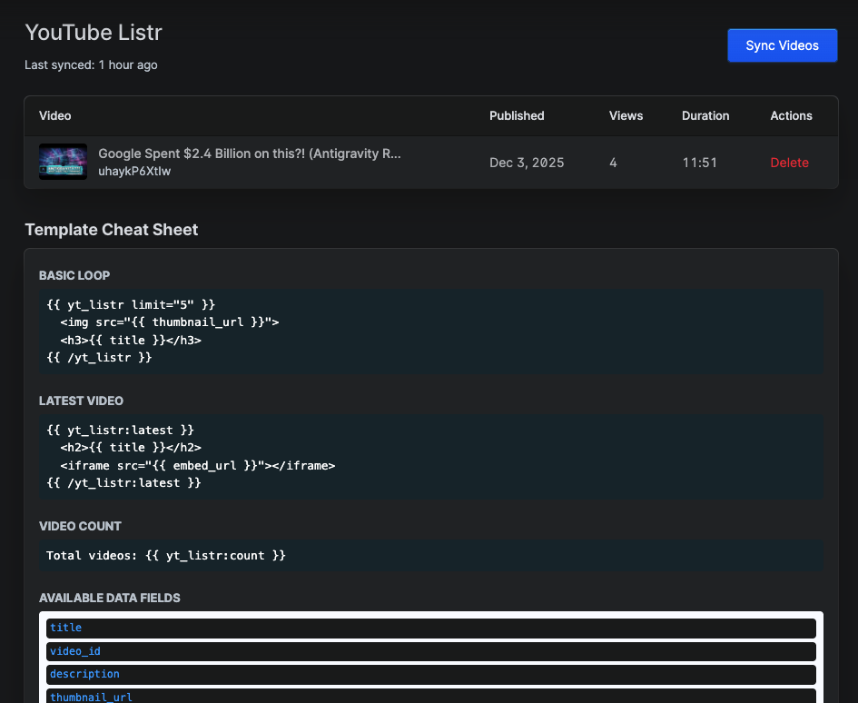
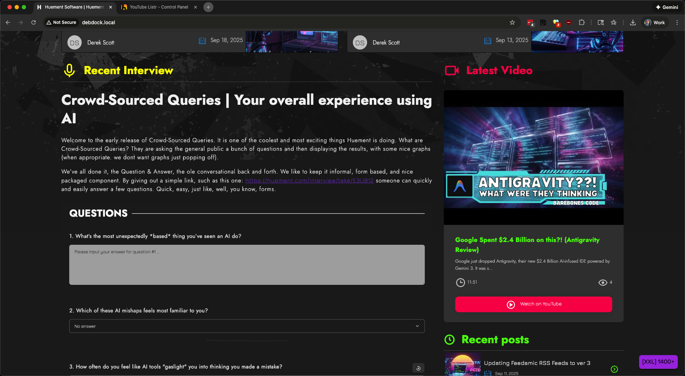

# Statamic YouTube Listr

A Statamic addon that syncs YouTube videos from a channel to your local database and provides Antlers tags to display them.


_Manage your YouTube videos directly from the Statamic Control Panel_

## Features

- 🎥 Sync YouTube videos from any channel
- 📊 View video stats (views, likes, duration)
- 🏷️ Easy-to-use Antlers tags for frontend display
- 🔄 Manual or automated syncing
- 💾 Local database storage for fast access
- 🎨 Clean Control Panel interface

## Installation

You can install the package via Composer:

```bash
composer require huement/statamic-ytlistr
```

The package will automatically register itself with Statamic.

### Requirements

- PHP ^8.1
- Statamic CMS ^5.0

## Configuration

Add these variables to your `.env` file:

```env
YOUTUBE_API_KEY=your_youtube_api_key
YOUTUBE_CHANNEL_ID=your_youtube_channel_id
YOUTUBE_MAX_RESULTS=50
```

## Usage

### Sync Videos

Via Control Panel:

- Navigate to Tools > YouTube Listr
- Click "Sync Videos from YouTube"

Via Command Line:

```bash
php artisan ytlistr:fetch
php artisan ytlistr:fetch --limit=100
```

### Antlers Tags


_Display your YouTube videos beautifully on the frontend_

List all videos:

```antlers
{{ yt_listr }}
    <h3>{{ title }}</h3>
    
    <p>{{ description }}</p>
    <a href="{{ youtube_url }}">Watch on YouTube</a>
{{ /yt_listr }}
```

Limit results:

```antlers
{{ yt_listr limit="5" }}
    <div>{{ title }}</div>
{{ /yt_listr }}
```

Get latest video:

```antlers
{{ yt_listr:latest }}
    <h2>{{ title }}</h2>
    <iframe src="{{ embed_url }}" frameborder="0" allowfullscreen></iframe>
{{ /yt_listr:latest }}
```

Get video count:

```antlers
Total videos: {{ yt_listr:count }}
```

## Available Data

Each video provides:

- `id` - Database ID
- `video_id` - YouTube video ID
- `title` - Video title
- `description` - Video description
- `thumbnail_url` - Thumbnail image URL
- `published_at` - Publication date
- `duration` - Duration in seconds
- `duration_formatted` - Human-readable duration (MM:SS)
- `view_count` - Number of views
- `like_count` - Number of likes
- `comment_count` - Number of comments
- `channel_id` - YouTube channel ID
- `channel_title` - Channel name
- `youtube_url` - Full YouTube URL
- `embed_url` - YouTube embed URL

## Credits

Created and sponsored by [Huement.com](https://huement.com) - A software studio creating awesome content and exceptional web experiences.

## Links

- [GitHub Repository](https://github.com/huement/statamic-ytlistr)
- [Packagist](https://packagist.org/packages/huement/statamic-ytlistr)
- [Huement.com](https://huement.com)

## License

MIT
